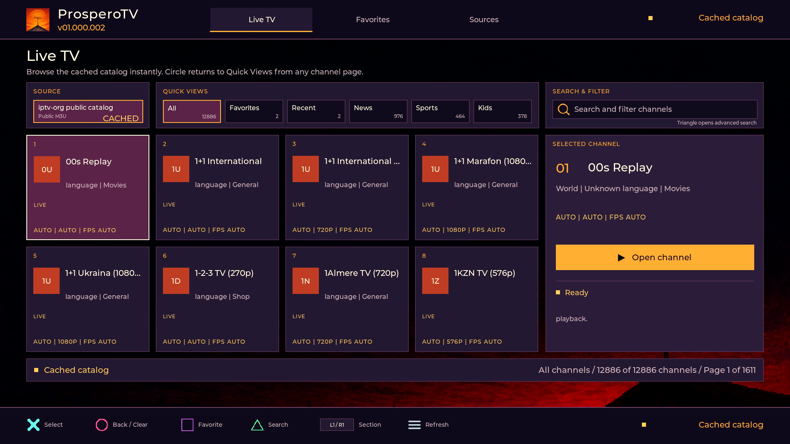

<p align="center">
  
</p>

<h1 align="center">ProsperoTV</h1>

<p align="center">
  <strong>A native IPTV client for PlayStation 5 homebrew</strong><br>
  Browse, search, and save channels from iptv-org, custom M3U playlists, or
  your own Xtream Codes provider with an offline-first SQLite cache, a
  controller-first interface, and native PS5 video decoding.
</p>

<p align="center">
  <a href="https://github.com/blackbearreloaded/ProsperoTV/actions/workflows/tooling.yml"></a>
  <a href="https://github.com/blackbearreloaded/ProsperoTV/releases/latest"></a>
  <a href="LICENSE"></a>
</p>

Demo available by clicking the image below.

[](https://i.imgur.com/oziiCgb.mp4)

## Highlights

- Browse thousands of community-maintained IPTV channels from the iptv-org
  catalog, add a custom HTTP(S) M3U playlist, or connect an Xtream Codes
  account.
- Search by name and filter by country, language, category, and advertised
  quality with continuous controller paging.
- Decode H.264, HEVC, and VP9 through native PS5 video paths at resolutions up
  to 4K.
- Keep the catalog, favorites, recent channels, and source state fast and
  persistent under `/download0`.
- Handle live HLS buffering, stale segments, alternate URLs, and failed feeds
  without destabilizing the next playback session.
- Use a polished full-screen RmlUi interface with DualSense navigation, native
  text input, dedicated Favorites, and an optional playback statistics overlay.

## Project foundations

> [!IMPORTANT]
> **Built on the [PS5 Native App Boilerplate](https://github.com/blackbearreloaded/ps5-native-app-boilerplate).**
> ProsperoTV retains its C++20 application structure, reproducible clean-room
> runtime, FSELF tooling, tests, deployment flow, and release automation.

> [!IMPORTANT]
> **Video work is documented in [PS5 Hardware Video Decoding Research](https://github.com/blackbearreloaded/ps5-hardware-video-decoding-research).**
> The companion repository records VideoDec2, H.264, HEVC, VP9, zero-copy AGC,
> resolution, and performance findings that informed ProsperoTV's native video
> pipeline.

> [!IMPORTANT]
> **Audio work is documented in [PS5 Audio Decoding Research](https://github.com/blackbearreloaded/ps5-audio-decoding-research).**
> The companion repository records codec, AJM, hardware and firmware offload,
> and output-path research that informed ProsperoTV's audio implementation.

> [!IMPORTANT]
> **Channel data comes from [iptv-org/iptv](https://github.com/iptv-org/iptv).**
> ProsperoTV is an independent client. Neither this project nor iptv-org hosts
> the listed streams, and channel availability can change without notice.

| Identity | Value |
| --- | --- |
| Shell title | `ProsperoTV` |
| Title ID | `PPSA99003` |
| Shell category | Media |
| Current beta version | `01.000.003` |
| Release-version source | [`sce_sys/param.json`](sce_sys/param.json) |
| Built-in catalog | `https://iptv-org.github.io/iptv/index.m3u` |
| Writable data | `/download0` only |

## Features

- Open the last verified channel catalog immediately from a local SQLite cache
  while a refresh runs in the background.
- Browse Live TV, Favorites, Recent, News, Sports, Kids, and other channel
  groups with continuous controller pagination.
- Search case-insensitively by channel name and filter by country, language,
  category, and advertised quality using the native PS5 keyboard.
- Keep favorites, recent channels, source selection, and catalog data under
  `/download0`; failed refreshes leave the last good database untouched.
- Add a custom HTTP(S) M3U or M3U8 playlist alongside the built-in iptv-org
  source.
- Add a user-supplied Xtream server, username, and password through masked
  native password entry; authenticate with the Player API and cache its live
  categories and channels locally.
- Return to the same screen, group, page, and channel after playback closes.
- Play HLS and direct MPEG-TS streams with H.264 or HEVC video and supported
  AAC audio through the native PS5 media path.
- Play direct WebM streams containing VP9 Profile 0 video.
- Adapt read-ahead buffering to live HLS timing and recover from stale live
  segments without discarding the channel immediately.
- Display codec, resolution, frame rate, and bitrate during playback; toggle
  the statistics overlay with Touchpad + R1.
- Report actionable failures for HTTP status, GeoIP restrictions, unavailable
  streams, unsupported encryption or codecs, malformed playlists, MPEG-TS
  synchronization, and native decoder errors.
- Render a full-screen RmlUi interface with packaged multilingual bitmap fonts
  and DualSense-focused navigation.

## Video support

| Codec | Supported path | Output classes |
| --- | --- | --- |
| H.264 / AVC | MPEG-TS and HLS; Baseline, Main, and High profiles within the configured level limits | 720p, 1080p, 1440p, 2160p |
| HEVC | MPEG-TS and HLS; Main profile, 8-bit 4:2:0 | 720p, 1080p, 1440p, 2160p |
| VP9 | Direct WebM; Profile 0, 8-bit 4:2:0 | 1080p, 1440p, 2160p |

Sources up to 1080p use a 1920×1080 presentation surface. Native 1440p video
is scaled to the 4K output surface, while 2160p video is decoded and presented
at 3840×2160. Codec and renderer details are documented in
[Architecture](docs/ARCHITECTURE.md) and [Testing](docs/TESTING.md).

## Controls

| Input | Action |
| --- | --- |
| D-pad / left stick | Move focus and continue across channel pages |
| Cross | Select, open, or play |
| Circle | Back, dismiss, or clear active filters |
| Square | Add or remove a favorite |
| Triangle | Open advanced search and filters |
| L1 / R1 | Switch between Live TV, Favorites, and Sources |
| Triangle on a configurable source | Edit the custom M3U URL or Xtream account |
| Options | Refresh the selected catalog source |
| Circle / Options during playback | Stop playback and return to the browser |
| Touchpad + R1 during playback | Toggle codec and performance statistics |

## Requirements

Building requires Linux, WSL, or a Linux CI runner. On Ubuntu, Debian, or WSL:

```bash
sudo apt update
sudo apt install clang-18 clang-format-18 clang-tidy-18 curl git lld-18 make \
  pkg-config python3 python3-pip python3-venv tar unzip wget libsqlite3-dev
```

The build downloads, verifies, and caches the public PS5 Payload SDK, zlib,
PacBrew's SQLite port, GoogleTest, and the selected packaging tools below the
ignored `.deps/` directory. No proprietary Sony SDK, firmware module,
encryption key, or game asset is included or fetched.

Run the read-only prerequisite check before building:

```bash
make doctor
```

See [Getting started](docs/GETTING_STARTED.md) and
[Native tooling](docs/NATIVE_TOOLING.md) for detailed environment setup.

## Build

[`sce_sys/param.json`](sce_sys/param.json) is the source of truth for the app
identity and release version. Keep `PPSA99003` when publishing an update;
changing the title ID creates a separate PS5 title.

```bash
# Lint, run all host tests, and build the complete title folder.
make check

# Build the compressed release image.
make ffpfsc
```

Release outputs are written to:

```text
dist/PPSA99003/           complete title folder
dist/PPSA99003.ffpfsc     compressed release image
```

An optional UFS2 `.ffpkg` development target is also available. See
[Package formats](docs/FFPKG.md).

## Install and development deployment

Install the generated `.ffpfsc` with a compatible PS5 homebrew workflow, or
stage the complete title folder below `/data/homebrew/PPSA99003`. Do not copy
`eboot.bin` by itself; the app also requires its runtime module, UI, fonts,
icons, artwork, and metadata.

For an FTP development deployment to an available PS5:

```bash
make deploy PS5_HOST=192.168.1.100 DEPLOY_FORMAT=folder
```

> [!NOTE]
> The first launch downloads, validates, and caches the iptv-org catalog. Keep
> the console online and leave ProsperoTV open until the catalog is ready.
> Later launches load the local database immediately.

Xtream support is for credentials supplied by the user. ProsperoTV does not
include, sell, or discover provider accounts. The server, username, and
password are stored in a local `/download0` record and are never written to the
application log; the credential record is not encrypted, so do not share title
data copied from the console.

Deployment writes only title-scoped paths under `/data/homebrew`. See
[Deployment](docs/DEPLOYMENT.md) for the complete workflow.

## Test and quality gates

```bash
make test            # GoogleTest unit suite and Python integration tests
make lint            # formatting, static analysis, metadata, and shell checks
make check           # lint + tests + complete folder build
make ffpfsc          # production folder + compressed release image
```

Host tests cover M3U and Xtream catalog parsing and persistence, HLS parsing,
HTTP error classification, MPEG-TS access-unit handling, VP9/WebM parsing,
native-app layout, runtime handoff, and presentation constraints. Hardware
acceptance is performed separately on PS5 with bounded channel samples,
decoder telemetry, and teardown checks.

GitHub Actions runs linting, all host tests, deterministic runtime
reproduction, and the FFPFSC build. Pushing a tag that exactly matches
`contentVersion` publishes the verified `.ffpfsc` image and `SHA256SUMS`.

## Source layout

```text
src/main.cpp                  Native SDL/RmlUi lifetime and renderer bridge
src/iptv_app.cpp              Screens, focus, search, paging, and user state
src/iptv_xtream.cpp           Xtream credentials, Player API parsing, and live URLs
src/iptv_player.cpp           Stream selection, buffering, playback, and errors
src/iptv_stream.cpp           MPEG-TS demux and H.264/HEVC access-unit assembly
src/iptv_native_backend.c     Native video/audio decode and presentation backend
src/iptv_catalog.cpp          Extended M3U catalog parser
src/iptv_store.cpp            SQLite last-good catalog persistence
src/iptv_webm.cpp             Bounded WebM/VP9 parser
include/                      Public application and media interfaces
ui/                           RML, RCSS, fonts, controller icons, and artwork
sce_sys/                      PS5 metadata and launcher assets
runtime/                      Reproducible clean-room libc.prx output
tooling/native/               ELF, FSELF, and runtime-generation tooling
tests/                        Host unit and integration regressions
docs/                         Architecture, build, testing, and deployment guides
```

## Versioning and releases

`contentVersion` in [`sce_sys/param.json`](sce_sys/param.json) drives the
packaged metadata, top-bar version, Git tag, and GitHub Release. It uses the
PS5 `NN.NNN.NNN` format without a `v` prefix.

```bash
# After updating param.json and passing the release gates:
git tag 01.000.003
git push origin main 01.000.003
```

The release workflow rejects a mismatched tag. See
[Configuration](docs/CONFIGURATION.md) for the coordinated metadata fields.

## Stream compatibility and limitations

- Public IPTV URLs can disappear, move, become GeoIP-restricted, require
  provider-specific headers, or reject access at any time.
- DRM and encrypted HLS media are intentionally unsupported.
- VP9 currently supports direct, video-only WebM Profile 0 streams. DASH,
  fragmented MP4, WebM audio, VP9 Profile 2, and general Matroska features are
  outside the supported path.
- MPEG-TS playback supports H.264 and 8-bit HEVC video. Unsupported audio may
  continue as silent video when the video path remains valid.
- Catalog metadata describes a channel but cannot guarantee that its current
  stream is online, correctly labeled, or compatible with the PS5 decoder.

ProsperoTV displays the most specific detected cause when a channel cannot be
played. A channel failure does not imply that the app, iptv-org, or the
console is unavailable.

## Credits and licences

ProsperoTV builds on and acknowledges:

- [PS5 Native App Boilerplate](https://github.com/blackbearreloaded/ps5-native-app-boilerplate),
  [PS5 Payload SDK](https://github.com/ps5-payload-dev/sdk),
  [PacBrew](https://github.com/ps5-payload-dev/pacbrew-repo),
  [MkPFS](https://github.com/PSBrew/MkPFS), and
  [UFS2Tool](https://github.com/SvenGDK/UFS2Tool).
- [iptv-org/iptv](https://github.com/iptv-org/iptv) for the public channel
  catalog and metadata.
- [ProsperoRadio](https://github.com/blackbearreloaded/ProsperoRadio) as the
  primary native application and user-experience reference.
- [IPTVnator](https://github.com/4gray/iptvnator) and
  [Megacubo](https://github.com/EdenwareApps/Megacubo) as IPTV product
  references.
- SDL2, RmlUi, FreeType, SQLite, zlib, LLVM, GoogleTest, Montserrat, Noto,
  DejaVu, and Source Han Sans.

Third-party software and data retain their own licences and terms. See
[NOTICE.md](NOTICE.md) for dependency and attribution details.

ProsperoTV is licensed under GPL-3.0-or-later. See [LICENSE](LICENSE) and
[Contributing](CONTRIBUTING.md).

PlayStation and PS5 are trademarks of Sony Interactive Entertainment. This
project is independent and is not affiliated with or endorsed by Sony.

This project was developed with assistance from OpenAI Codex, including
original interface artwork. Project maintainers reviewed and validated the
resulting code, tests, documentation, dependencies, and generated assets.
