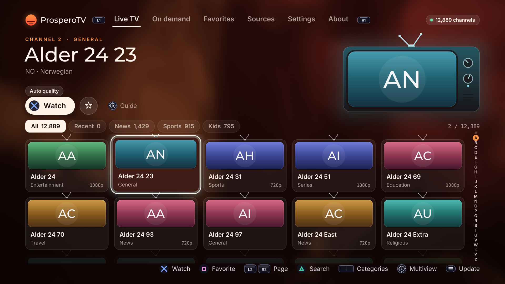

<p align="center">
  
</p>

<h1 align="center">ProsperoTV</h1>

<p align="center">
  <strong>A native IPTV client for PlayStation 5 homebrew</strong><br>
  Browse, search, and save channels from iptv-org, custom M3U playlists, or
  your own Xtream Codes provider with an offline-first SQLite cache, a
  controller-first interface, native PS5 video decoding, and updates that
  install themselves.
</p>

<p align="center">
  <a href="https://github.com/blackbearreloaded/ProsperoTV/actions/workflows/tooling.yml"></a>
  <a href="https://github.com/blackbearreloaded/ProsperoTV/releases/latest"></a>
  <a href="LICENSE"></a>
</p>



> [!NOTE]
> **Version 01.000.020 brings a new interface.** It is built on
> [ps5-homebrew-ui](https://github.com/blackbearreloaded/ps5-homebrew-ui) and lives in
> [`opengl-ui/`](opengl-ui/); the catalog, the stores, and the player are the ones earlier
> versions used. Coming from 01.000.015 or older: see [Updating ProsperoTV](#updating-prosperotv).

## Highlights

- Browse thousands of community-maintained IPTV channels from the iptv-org
  catalog, add a custom HTTP(S) M3U playlist, or connect an Xtream Codes
  account.
- Search by name and filter by country, language, category, and advertised
  quality with continuous controller paging.
- Decode H.264, HEVC, and VP9 through native PS5 video paths at resolutions up
  to 4K.
- Keep the catalog, favorites, recent channels, and source state fast and
  persistent under `/data/prosperotv`, where an update never touches them.
- Update from inside the app: a newer version listed on
  [homebrew.page](https://homebrew.page) is offered at launch with its release
  notes, downloaded, and installed in place.
- Handle live HLS buffering, stale segments, alternate URLs, and failed feeds
  without destabilizing the next playback session.
- Use a full-screen OpenGL interface at up to 4K with DualSense navigation,
  channels drawn as television sets, an alphabet beside every list, native
  text input, dedicated Favorites, and an optional playback statistics overlay.

## Project foundations

> [!IMPORTANT]
> **Built on the [PS5 Native App Boilerplate](https://github.com/blackbearreloaded/ps5-native-app-boilerplate).**
> ProsperoTV retains its C++20 application structure, reproducible clean-room
> runtime, FSELF tooling, tests, deployment flow, and release automation.

> [!IMPORTANT]
> **Channel data comes from [iptv-org/iptv](https://github.com/iptv-org/iptv).**
> ProsperoTV is an independent client. Neither this project nor iptv-org hosts
> the listed streams, and channel availability can change without notice.

| Identity | Value |
| --- | --- |
| Shell title | `ProsperoTV` |
| Title ID | `PPSA99003` |
| Shell category | Media |
| Current version | `01.000.040` |
| Release-version source | [`sce_sys/param.json`](sce_sys/param.json) |
| Built-in catalog | `https://iptv-org.github.io/iptv/index.m3u` |
| Writable data | `/data/prosperotv`; the title's own `/download0` when filesystem access is not available |

## Features

### Sources

- Use the built-in iptv-org catalog, or add your own: HTTP(S) M3U/M3U8
  playlists, Xtream Codes accounts (masked password entry), MAC-code portals
  (Stalker/Ministra style), and tuners or servers on the home network such as
  HDHomeRun and Tvheadend.
- Keep several sources, each with its own cache, visible categories, and
  refresh schedule: daily, weekly, or only when asked.
- Load large providers: up to 250,000 channels from one source, read as the
  list downloads.
- Choose which of a provider's categories appear. Hiding a parent hides all of
  its subcategories.
- Add and edit playlists and accounts from a phone or a computer with the
  [phone remote](#phone-remote), instead of the on-screen keyboard.

### Browsing

- Open the last verified catalog at once from a local cache while a refresh
  runs in the background.
- Browse Live TV by the provider's own categories and subcategories, shown as
  the row of filters above the channels, beside Favorites and Recent.
- Search by channel name, and filter by country, language, category, and
  advertised quality, with the native PS5 keyboard.
- See channel logos on the tiles and on the large television.
- Preview the focused live channel, with sound, on the large television after
  a moment on it.
- Turn pages by holding L2 or R2, faster the longer they are held, in Live TV,
  Movies, and Series; jump by letter with the column beside every list.
- Keep up to 65,536 favorites, organized in named folders.
- Hide the channels that did not open the last time, and start on the channel
  watched last, from Settings.
- Return to the same screen, group, page, and channel after playback closes.

### Programme guide

- See what each channel is showing now and next, from the guide a playlist or
  an account points to.
- Open the full grid of channels and hours, and start a channel from it.
- Search programmes by title, not only channels by name.
- Play a programme that has already been shown, on channels whose provider
  keeps a catch-up archive.

### Movies and series

- Browse an Xtream account's movies, shows, seasons, and episodes in
  **On demand**.
- Play H.264 and HEVC in MP4 or Matroska, up to 4K.

### While watching

- Zap with up and down, go back to the channel watched before with one
  button, or pick another channel from a list over the picture.
- See a banner with the channel's name and its programme when a channel opens
  or when asked for.
- Choose among the audio tracks a channel carries, and show its subtitles.
- Pause live TV and go back a few minutes.
- Set a sleep timer.
- Watch two or four live channels side by side in Multiview, with sound
  following the focused one. Four 720p H.264 feeds are validated on hardware;
  higher resolutions depend on the decoder resources available.
- Show codec, resolution, frame rate, and bitrate with Touchpad + R1.

### Picture and sound

- Play HLS and direct MPEG-TS streams with H.264 or HEVC video, and direct
  WebM streams with VP9 Profile 0, through the PS5's hardware decoders.
- Show HDR10 and HLG channels as HDR, with SDR tone mapping when HDR output is
  not available.
- Present each field of an interlaced broadcast separately to keep its motion.
- Play AAC, MP2, AC-3, and E-AC-3 sound; surround is downmixed to stereo,
  including the dialogue channel.
- Keep the picture in step with the sound: frames are timed against the sound
  being played.
- Adapt buffering to live HLS timing, and recover from stale segments and
  alternate addresses without giving up on the channel.
- Show a tuning screen until the channel's first picture, and say why a
  channel did not open: HTTP status, regional restriction, unsupported
  encryption or codec, malformed playlist, or decoder error.

### Household

- Lock adult categories behind a parental PIN, and switch to a mode that shows
  only the channels for children.
- Keep favorites, recent channels, and sources separate for each person signed
  in on the console.
- Use the interface in English, Spanish, French, German, Italian, Portuguese,
  or Dutch, following the console's language. Provider content keeps its own
  text.
- Back up sources, favorites, and settings to a USB drive, and restore them on
  this console or another.

### The app

- Control the app from a phone's browser with the
  [phone remote](#phone-remote).
- Update in place: a newer version is offered at launch with **Update now**,
  **What's new**, and **Later**, and everything saved is kept.
- Keep all data under `/data/prosperotv`, where an update never touches it; a
  failed refresh leaves the last good catalog untouched.
- Send a useful problem report: a diagnostic log switch in Settings (off by
  default, no account details), and a failure report saved to a USB drive.
- Use a full-screen OpenGL interface at up to 4K, built with the
  [ps5-homebrew-ui](https://github.com/blackbearreloaded/ps5-homebrew-ui) kit,
  with fonts for Latin, Greek, Cyrillic, Chinese, Japanese, and Korean channel
  names, interface sounds, and a Reduce motion setting.

Provider requirements and validation for these features are in
[the implementation guide](docs/ROADMAP_IMPLEMENTATION.md).

## Video support

| Codec | Supported path | Output classes |
| --- | --- | --- |
| H.264 / AVC | MPEG-TS, HLS, MP4 and Matroska; Baseline, Main, and High profiles within the configured level limits | 720p, 1080p, 1440p, 2160p |
| HEVC | MPEG-TS, HLS, MP4 and Matroska; Main / Main10, 8-bit or 10-bit 4:2:0, SDR output | 720p, 1080p, 1440p, 2160p |
| VP9 | Direct WebM; Profile 0, 8-bit 4:2:0 | 1080p, 1440p, 2160p |

Sources up to 1080p use a 1920×1080 presentation surface. Native 1440p video
is scaled to the 4K output surface, while 2160p video is decoded and presented
at 3840×2160. Codec and renderer details are documented in
[Architecture](docs/ARCHITECTURE.md) and [Testing](docs/TESTING.md).

## Controls

| Input | Action |
| --- | --- |
| D-pad / left stick | Move focus; Right past the last column reaches the letters |
| Cross | Select, open, or play |
| Circle | Back, dismiss, or clear active filters |
| Square | Add or remove a favorite |
| Triangle | Open advanced search and filters |
| L1 / R1 | Switch between Live TV, Favorites, Sources, On demand, Settings, and About |
| L2 / R2 | Previous or next page; hold to keep turning |
| Triangle on a configurable source | Edit the custom M3U URL or Xtream account |
| Square in Sources | Cycle daily, weekly and manual refresh |
| Touchpad in Live TV / Favorites | Provider categories / favorite folders |
| R3 in the channel browser | Open the programme guide |
| L3 in Live TV / Favorites | Open Multiview; Square chooses a channel, Triangle switches two/four tiles, R3 mutes, Cross opens full screen |
| Options | Refresh the selected catalog source |
| Circle during playback | Close the open panel, or stop playback and return to the browser |
| Options during playback | Open or close the audio/subtitle track panel |
| L1 / R1 in the track panel | Switch between Audio and Subtitles |
| Touchpad + R1 during playback | Toggle codec and performance statistics |

## Phone remote

Connect your phone to the same Wi-Fi, then select **Settings → Pair a phone**
on the TV. Scan the QR code (or type the displayed address) and enter the
six-digit code on the website. The code expires after two minutes, is accepted
once, and is cancelled when you close the pairing screen. No app installation
or internet connection is needed for the remote. The dialog closes automatically
when a newly paired or remembered browser connects, and the TV shows "Phone connected".

The TV remembers up to eight browsers. A saved browser reconnects after a page
reload or app restart without another code. Its cookie lasts one year; private
browsing, clearing cookies, or a changed console IP may require pairing again.
Use **Forget this phone** on the website or **Forget paired phones** in TV
Settings to revoke access. Pairing must be saved on the console before the
website reports success.

Use the arrows and OK to navigate, Back to return or stop playback, and the
section and favorite buttons for the corresponding controller actions.
While a channel is playing, **Favorite** adds or removes that channel without
stopping playback; the phone confirms the change after it is saved.
Type a channel name on the phone and tap **Search on TV** (or the keyboard's Search
key). **Clear** removes the text query; existing category/country filters still
apply. Search accepts up to 39 Unicode characters and is available in the
channel browser. It also works while the TV's native search keyboard is open.
The **Search & filters on TV** button opens the existing advanced search panel.

The **Volume** sliders in TV Settings and on the phone control the same saved
ProsperoTV volume, including live playback and interface sounds. Zero mutes it;
100% keeps the stream's original level. This does not change the television's
hardware volume.

The remote uses HTTP on your local network. Use it on a trusted LAN and do not
forward its port to the internet. The app requests port 8888 and uses an assigned
port when that is unavailable. Use the current address on the pairing screen;
the saved browser credential remains valid if only the port changes. Controller
use continues even if the remote cannot start.

## Requirements

Building requires Linux, WSL, or a Linux CI runner. On Ubuntu, Debian, or WSL:

```bash
sudo apt update
sudo apt install clang-18 clang-format-18 clang-tidy-18 curl git lld-18 make \
  pkg-config python3 python3-pip python3-venv tar unzip wget libsqlite3-dev \
  cmake ninja-build libpng-dev libjpeg-dev zlib1g-dev
```

The build downloads, verifies, and caches the public PS5 Payload SDK, zlib,
PacBrew's SQLite port, and GoogleTest below the
ignored `.deps/` directory. No proprietary Sony SDK, firmware module,
encryption key, or game asset is included or fetched.

Run the read-only prerequisite check before building:

```bash
make doctor
```

See [Getting started](docs/GETTING_STARTED.md) and
[Native tooling](docs/NATIVE_TOOLING.md) for detailed environment setup.

## Build

[`sce_sys/param.json`](sce_sys/param.json) is the source of truth for the app
identity and release version. Keep `PPSA99003` when publishing an update;
changing the title ID creates a separate PS5 title.

```bash
# Lint and run the host tests of the shared catalog, stores, and player.
make lint
make test

# The released app: the interface in opengl-ui/ on top of those sources.
opengl-ui/tools/run-tests.sh
opengl-ui/ps5/assemble.sh
make -C ../prosperotv-ui-build app
```

Release outputs are written beside the repository:

```text
../prosperotv-ui-build/dist/PPSA99003/       complete title folder
../prosperotv-ui-build/dist/PPSA99003.zip    the release download
```

GitHub Releases provide `PPSA99003.zip`, which contains the complete
`PPSA99003` title folder, and `SHA256SUMS`. See
[`opengl-ui/README.md`](opengl-ui/README.md) for how that build is put
together. A release ZIP built by GitHub Actions can
be checked with the GitHub CLI:
`gh attestation verify PPSA99003.zip -R blackbearreloaded/ProsperoTV`
(releases built from now on, not earlier ones).

The repository root still builds the interface of 01.000.015 and earlier
(`make check`, `make app`); it shares the catalog, stores, and player with
the released app and is kept for their tests. It is no longer released.

## Install and development deployment

Extract `PPSA99003.zip` and upload its complete `PPSA99003` folder to
`/data/homebrew`, producing `/data/homebrew/PPSA99003/eboot.bin`.
[ShadowMountPlus](https://github.com/drakmor/ShadowMountPlus) then puts
ProsperoTV on the home screen.

Do not upload the ZIP itself or copy only `eboot.bin`; the app also requires
its runtime module, fonts, sounds, artwork, metadata, and the two helper
programs beside `eboot.bin`.

ProsperoTV asks the console's payload loader (port 9021, which a
ShadowMountPlus setup already runs) for filesystem access when it starts. With
it, the app keeps its files in `/data/prosperotv` and can update itself.
Without it, the app runs in its own storage as earlier versions did and is
updated by hand.

### Updating ProsperoTV

From 01.000.020 on, ProsperoTV checks [homebrew.page](https://homebrew.page)
once per launch. When a newer version is listed it offers **Update now**,
**What's new**, and **Later**. The update downloads the release, closes the
app, and replaces its files; sources, favorites, recent channels, and settings
stay as they are. An app installed as an image cannot update itself.

Coming from 01.000.015 or older, update by hand once:

1. Fully close ProsperoTV.
2. If you installed `PPSA99003.ffpfsc`, delete it from `/data/homebrew`; the
   image form is no longer published, and the folder and the image must not
   both be in ShadowMountPlus scan paths.
3. Upload the complete `PPSA99003` folder from the ZIP to `/data/homebrew`,
   replacing the old one.
4. Restart ShadowMountPlus or the PS5, and wait for the title to be
   rediscovered before launching it.

Keeping the `PPSA99003` title ID lets the new version find the sources,
favorites, history, and account the old one saved; it copies them to
`/data/prosperotv` the first time it starts.

> [!NOTE]
> The first launch downloads, validates, and caches the iptv-org catalog. Keep
> the console online and leave ProsperoTV open until the catalog is ready.
> Later launches load the local database immediately.

Xtream support is for credentials supplied by the user. ProsperoTV does not
include, sell, or discover provider accounts. The server, username, and
password are stored in a local record beside the app's other data and are never written to the
application log; the credential record is not encrypted, so do not share title
data copied from the console.


## Test and quality gates

```bash
make test                      # GoogleTest unit suite and Python integration tests
make lint                      # formatting, static analysis, metadata, and shell checks
opengl-ui/tools/run-tests.sh   # the interface and its logic, under ASan and UBSan
```

Host tests cover M3U and Xtream catalog parsing and persistence, HLS parsing,
HTTP error classification, MPEG-TS access-unit handling, VP9/WebM parsing,
native-app layout, runtime handoff, and presentation constraints. Hardware
acceptance is performed separately on PS5 with bounded channel samples,
decoder telemetry, and teardown checks.

GitHub Actions runs linting, the host tests, and deterministic runtime
reproduction on every pull request and version tag, and checks that the tag matches
`contentVersion`. A pull request's build is uploaded under its number and
commit: see [Pull-request builds](docs/PULL_REQUEST_BUILDS.md). The same run
builds the released app from `opengl-ui/` on a clean machine, fetching every
dependency at its pinned version. A version tag also publishes: the ZIP that
run built is attached to a GitHub Release with its `SHA256SUMS` and the notes
in `docs/releases/<version>.md`. No release is built anywhere else. A push to
`main` builds nothing; a build on `main` is started by hand (**Actions**,
**Build**, **Run workflow**).

## Source layout

```text
opengl-ui/                    The released interface, its logic, tests, and console build
src/main.cpp                  Earlier interface: SDL/RmlUi lifetime and renderer bridge
src/iptv_app.cpp              Earlier interface: screens, focus, search, and paging
src/iptv_xtream.cpp           Xtream credentials, Player API parsing, and live URLs
src/iptv_player.cpp           Stream selection, buffering, playback, and errors
src/iptv_stream.cpp           MPEG-TS demux and H.264/HEVC access-unit assembly
src/iptv_native_backend.c     Native video/audio decode and presentation backend
src/iptv_catalog.cpp          Extended M3U catalog parser
src/iptv_store.cpp            SQLite last-good catalog persistence
src/iptv_webm.cpp             Bounded WebM/VP9 parser
include/                      Public application and media interfaces
ui/                           Earlier interface: RML, RCSS, fonts, and icons
sce_sys/                      PS5 metadata and launcher assets
runtime/                      Reproducible clean-room libc.prx output
tooling/native/               ELF, FSELF, and runtime-generation tooling
tests/                        Host unit and integration regressions
docs/                         Architecture, build, testing, and deployment guides
```

## Versioning and releases

`contentVersion` in [`sce_sys/param.json`](sce_sys/param.json) drives the
packaged metadata, the version on the About page, the Git tag, and the GitHub Release. It uses the
PS5 `NN.NNN.NNN` format without a `v` prefix.

```bash
# After updating param.json and passing the release gates:
git tag 01.000.040
git push origin main 01.000.040
```

The workflow rejects a mismatched tag, builds the app, and publishes the
release with the notes in `docs/releases/01.000.040.md`. See
[Configuration](docs/CONFIGURATION.md) for the coordinated metadata fields.

A release is made by pushing the version tag and in no other way: the
workflow builds, attests, and publishes `PPSA99003.zip` and `SHA256SUMS`, and
files are not attached by hand. If the tag has no release yet, the workflow
creates it; if a release exists without a ZIP (notes written in advance, or a
draft), it adds the two files and leaves the title and notes alone; if a
release already has a ZIP, nothing is replaced and the run ends with a
warning.

## Stream compatibility and limitations

- Public IPTV URLs can disappear, move, become GeoIP-restricted, require
  provider-specific headers, or reject access at any time.
- DRM and encrypted HLS media are intentionally unsupported.
- VP9 currently supports direct, video-only WebM Profile 0 streams. DASH,
  fragmented MP4, WebM audio, VP9 Profile 2, and general Matroska features are
  outside the supported path.
- Interlaced H.264 presents each field separately, preserving broadcast motion
  at 50 or 60 fields per second. Spatial bob reduces vertical detail in each
  field; it does not perform motion-adaptive reconstruction. Interlaced streams
  rejected by the hardware decoder use bounded software decoding up to 1080i.
- MPEG-TS playback supports H.264 and 8-bit/10-bit HEVC video. Main10 uses hardware
  decoding and GPU presentation. BT.2020/PQ and HLG select HDR10 output; HLG
  converts to PQ, and rejected HDR output requests fall back to SDR tone mapping.
  Static mastering/content-light metadata is retained, but custom HDMI metadata
  forwarding is unverified. The Main10 presentation path currently requires
  decoder pitch to match visible width (standard 720p/1080p/1440p/2160p widths).
  Unsupported audio may
  continue as silent video when the video path remains valid.
- A source may hold up to 250,000 channels; a larger one loads its first
  250,000 and says so. A list of that size takes about 75 MiB of memory and
  a minute or more to download from a slow provider.
- Catalog metadata describes a channel but cannot guarantee that its current
  stream is online, correctly labeled, or compatible with the PS5 decoder.

ProsperoTV displays the most specific detected cause when a channel cannot be
played. A channel failure does not imply that the app, iptv-org, or the
console is unavailable.

<!-- bbr-footer:start -->
<!-- Generated by ps5-homebrew-dev-protocol/scripts/readme-footer. Edit the template there, not here. -->

## Credits

Built with the [PS5 Payload SDK](https://github.com/ps5-payload-dev/sdk) by John Törnblom (ps5-payload-dev).
Third-party components, authors and licenses are listed in
[THIRD_PARTY_NOTICES.md](THIRD_PARTY_NOTICES.md).

## License

Copyright © 2026 BlackBearReloaded. Licensed under GPL-3.0-or-later; see [LICENSE](LICENSE). Third-party components keep their own licenses. Binary releases are built from the tagged source in this repository.

## Disclaimer

- **No affiliation.** This is an independent homebrew project. It is not
  affiliated with, endorsed by, or sponsored by Sony Interactive Entertainment.
  "PlayStation", "PS5" and related marks are trademarks of Sony Interactive
  Entertainment Inc. This project is not affiliated with or endorsed by iptv-org.
- **No proprietary material.** No Sony SDK, firmware, encryption keys or
  decrypted system modules are included.
- **No warranty.** This project is provided "as is", without warranty of any
  kind, to the extent permitted by law. See sections 15 and 16 of the GPL.
- **Use at your own risk.** Running homebrew requires a modified console, which
  may void its warranty, breach the platform's terms of service, or cause data
  loss.
- **Legal use only.** Use it only with hardware, accounts and content you own.
  This project does not support or enable piracy.

## AI assistance

This project was developed with AI assistance from OpenAI and/or Anthropic tools.
<!-- bbr-footer:end -->
